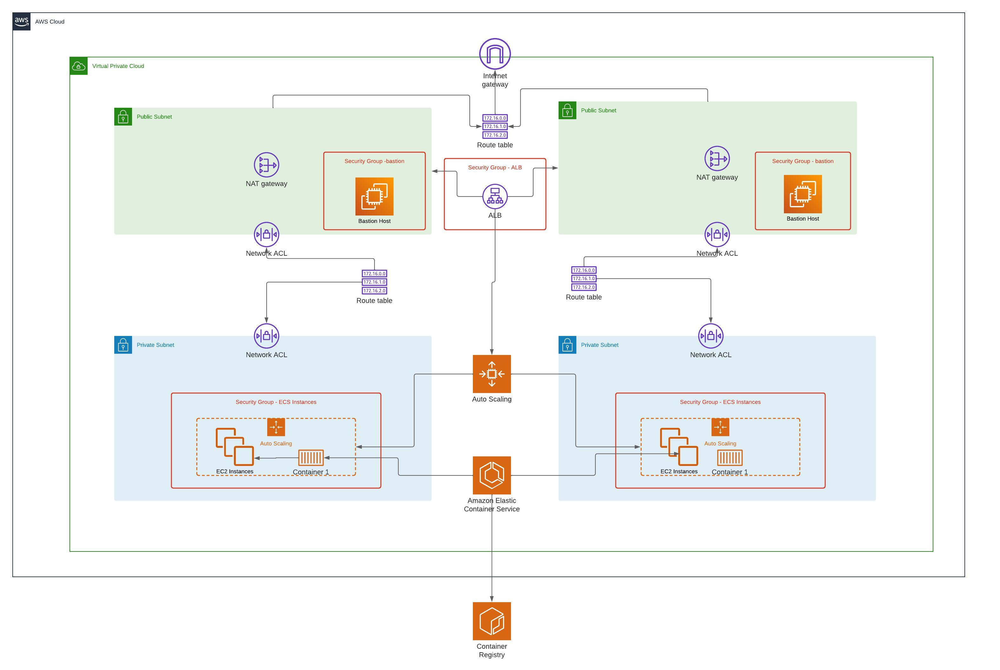

# Salsify DevOps Challenge

## Goal:
* Deploy a containerized application on AWS


## Requirements
The requirements of the exercise are the following:
- Must use AWS.  The AWS free tier should be sufficient.  If your ideal solution would use additional paid services please include that information in your README
- Take the [Sample Application](https://github.com/salsify/gifmachine) and create a Dockerfile for it, capable of running it within AWS.
  - Successfully able to accept the expected (as per the README of the application) http requests, and display them to clients.
  - Able to connect to a running database.
  - Available via the internet.
- Automate deploying your containerized application to the AWS service of your choice.
- Automate setting up the hosting environment for your application.
  - This *does not* require automation for setting up and configuring the database required by the application. That can be configured out-of-band in whatever means you find reasonable (RDS is one straightforward option).
- Create a test command/script capable of verifying that the application is up and running as expected.

## How this project was structured:
I've decided to include infra code in the same branch as the application code, taking into consideration this an exercise. We could improve the strategy using mono repo practices. 

### About ./app
./app contains the [Sample Application](https://github.com/salsify/gifmachine) and a Dockerfile using a multi-stage build strategy to generate a container image as small as possible. This improves the speed for uploading/downloading the image on ECS service. There's a GitHub Action that triggers automatically every time something is pushed to this repository, building the 'latest' image and publishing it to ECR (elastic container registry) service from AWS. 

If you want to build the image locally, follow these steps:
1. **Clone the Repository**: 

     ```bash
    git clone git@github.com:m-marcal/salsify-challenge.git
    ```

2. **Build**: 

     ```bash
     cd ./app
    docker build -t gifmachine:latest .
    ```

3. **Run**: 

     ```bash
    docker run --rm -p4567:4567 -e DATABASE_URL="postgres://db_user:db_pass@db_addr:db_port/gifmachine" -e RACK_ENV=production gifmachine:latest
    ```

4. **(Optional) Push to Docker Hub**: 

     ```bash
    docker login # Enter docker hub credentials
    docker tag gifmachine:latest "{YOU_DOCKER_HUB_USER_PREFIX}/gifmachine:latest"
    docker push "{YOU_DOCKER_HUB_USER_PREFIX}/gifmachine:latest"
    ```

### About ./infra

The infrastructure is based on [another project](https://github.com/m-marcal/infinet_aws_ecs) that I made showcasing Elastic Container Service from AWS. It turns the containerized application highly available by running across multiple Availability Zones (same region). For more details about ECS, check [AWS docs](https://aws.amazon.com/ecs/).

#### AWS Services

- **ECR Repository**: The Docker image of the application is stored in AWS ECR, which is a fully managed Docker container registry that allows developers to store, manage, and deploy Docker container images.

- **Self-managed cluster instances**: Instead of giving full control over infrastructure to AWS, this project does not use "Fargate" as a deployment model. It handles most of the infra aspects like networking, storage, security, and so on. This is ideal if you have strict compliance to implement.
- **High-level infra components**: 
    - 2 public subnets (distinct av. zones)
    - 2 private subnets (distinct av. zones)
    - 1 Application load balancer
    - 1 Bastion host
    - Auto-scaling group (EC2 instances)
    - ACLs, sec. groups, routes applying the least privilege principle

- **High-level design:**


### Provisioning infra
All AWS components should be deployed by [Terraform deployment Action](.github/workflows/terraform_deployment.yml), but you need the following "Secrets" for everything to work smoothly. 
 ```bash
    AWS_ACCESS_KEY_ID
    AWS_SECRET_ACCESS_KEY
    AWS_DEFAULT_REGION
    TF_VAR_database_url # like: postgres://db_user:db_pass@db_addr:db_port/gifmachine
```
- **Important note!**: Once infra is correctly provisioned, you need to configure the secret "AWS_ECR_REPOSITORY" URL for [Create Container Image (build & push) Action](.github/workflows/terraform_deployment.yml) to work properly.

### (Optional) build infra locally. 
Although not recommended, you can use terraform locally to provision all the resources. For specific instruction on "how-to-do-it", please check [Infra README](infra/README.md)


## ECS Deployment. 
This project takes benefit of ECS Rolling update strategy, which basically replaces the currently running tasks with new tasks. I'm going to use Circuit breaker strategy that stops the deployment if a new task cannot be started. It has also enabled the functionality to "rollback" in case the circuit brakes. Deployments can be trigered manually using [Force Deployment Action](.github/workflows/force_deploy.yml) 